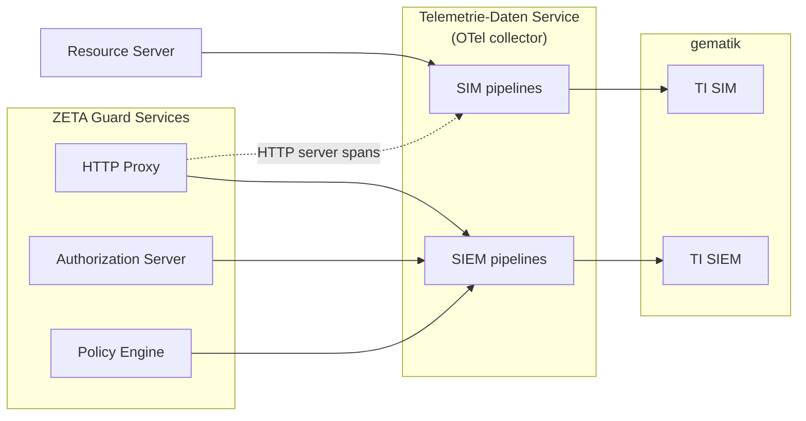
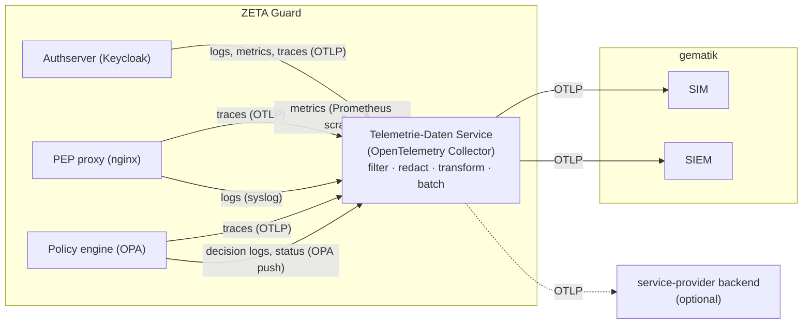

# Telemetry in ZETA Guard

This explanation focuses on the **helm-chart-specific** aspects of telemetry:
what each component emits, how it is enabled, and how to observe it locally. The
overall architecture of the telemetry data service (collector distribution,
pipelines, redaction, export to gematik) is documented in the gematik
documentation — see the *Telemetry data service* concept and the observability
how-tos in the
[gematik user manual](https://github.com/gematik/zeta/tree/main/docs/user-manual).
For the concrete catalog of trace attributes, see
[Telemetry attributes](../reference/Telemetry_attributes.md).

## Simplified telemetry flow to gematik

All telemetry from resource servers is exported to TI SIM, and select
security-related telemetry from ZETA guard is exported to TI SIEM.



## What each component emits

- **Authserver (Keycloak)** — runs on Quarkus with built-in OpenTelemetry
  instrumentation. Emits traces, metrics, and logs via OTLP to the
  telemetry-gateway, and also writes logs to stdout.
- **PEP proxy (NGINX + Rust module)** — emits traces via the native NGINX
  OpenTelemetry module (`ngx_otel_module`), nginx logs go to stdout and via syslog
  to the telemetry-gateway. `ngx_pep` emits traces, logs, and metrics via OTLP separately.
  It re-parents its spans under the `ngx_otel_module` spans, and emits [Trace Context](https://www.w3.org/TR/trace-context/)
  headers for outbound requests.
- **OPA / OPA simulation (policy engine)** — emit traces (OTLP) and metrics, and
  push decision logs and status updates to the telemetry-gateway through
  OPA's own mechanism.

All signals are collected and processed by the telemetry-gateway (an
[OpenTelemetry Collector](https://opentelemetry.io/docs/collector/); the
*Telemetriedaten-Service* in the specification), which exports them to the
gematik telemetry endpoints and, optionally, to the operating service provider's
own monitoring/SIEM.



There are no log-collectors in ZETA Guard: Keycloak, OPA, and nginx send
parts of their logs directly to the telemetry-gateway as shown above; any other
container logs are not collected. The telemetry-gateway scrapes Prometheus
metrics from the components.

## Enabling telemetry

Telemetry is on by default. The base values live in
`charts/zeta-guard/values.yaml` and are overridden in several other values
files (per stage):

| Value                      | Effect                                                                        |
|----------------------------|-------------------------------------------------------------------------------|
| `telemetryGatewayEnabled`  | Deploys the telemetry-gateway (default `true`).                               |
| `telemetryGatewayHost`     | Fully-qualified hostname the telemetry gateway is reached at (default empty). |
| `pepproxyTracingEnabled`   | Loads `ngx_otel_module.so` and enables PEP tracing (default `true`).          |
| `authServerTracingEnabled` | Sets `KC_TRACING_ENABLED` on the authserver (default `true`).                 |

By default every signal is sent to the bundled telemetry-gateway under its bare
service name (`<release>-telemetry-gateway`, or
`telemetry-gateway.fullnameOverride`
when set), which relies on the pod's DNS search path to resolve. In some
clusters
that bare name does not resolve from the components — the cluster DNS does not
apply
the search path to the exporter's resolver, the gateway lives in another
namespace,
or the cluster domain is not `cluster.local` — and telemetry silently fails to
reach
the gateway. Set **`telemetryGatewayHost`** to the fully-qualified hostname of
the
gateway to fix this, e.g.
`zeta-guard-telemetry-gateway.<namespace>.svc.cluster.local`. The single value
redirects **all** telemetry destinations at once — the PEP OTLP traces endpoint
and
syslog `error_log`/`access_log`, the OPA OTLP address, and the authserver OTLP
endpoint — because they all resolve through the `telemetryGateway.hostname`
helper.
As a Helm value it survives chart upgrades, so no hand-editing of the rendered
ConfigMap is needed (which is not permitted in production). This mirrors the
pattern
the chart already uses for OPA via `authserver.provider.smcB.opaBaseUrl`.

The value changes **only the address** under which the telemetry-gateway is
reached — never the destination. Telemetry must always go to the
telemetry-gateway: the `redaction` processor and the `filter/ti_sim` /
`filter/ti_siem` filters live in its pipelines and are not bypassable. To feed
your own observability backend, add an exporter **inside** the gateway's
`dienst_hersteller` pipelines instead of redirecting the producers. It takes
precedence over `telemetry-gateway.fullnameOverride`. It is a hostname only; the
ports (`4317` OTLP, `54526` syslog, `49152`/`49153` OPA) are fixed. If you run
the gateway outside this chart, the operator must also allow egress to it — the
`pep-proxy`, `opa`, `opa-simulation` and `authserver` egress NetworkPolicies
only permit a same-namespace `opentelemetry-collector` pod as the destination.

The in-cluster hops to the gateway are plaintext; their transport security is
delegated to the service mesh. With `global.istio.enabled` the chart renders a
namespace-wide `STRICT` `PeerAuthentication` without port exceptions, so it
covers the OTLP, syslog and OPA ports as well. Without a mesh, secure them as
described in the produkthandbuch guide *Wie Sie Telemetrie des Resource Servers
an die gematik schicken* — mandatory mTLS applies to connections towards
ZETA-Guard-**external** services.

> **Note:** `pepproxyTracingEnabled` must be `false` whenever
> `telemetryGatewayEnabled` is `false` — otherwise NGINX fails to start with
> `unknown directive "otel_resource_attr"`.

Each component is tagged with an OpenTelemetry `service.name`. Service names are
important for observability in general (correlating signals to a component):

| Component                                        | `service.name`                              |
|--------------------------------------------------|---------------------------------------------|
| PEP proxy                                        | `ZETA Guard PEP HTTP proxy`                 |
| Authserver                                       | `ZETA Guard PDP authorization server`       |
| OPA                                              | `ZETA Guard PDP policy engine`              |
| OPA simulation                                   | `ZETA Guard PDP policy engine (simulation)` |
| Resource server (testfachdienst, test component) | `resource server` or `rs.*`                 |

## What the telemetry-gateway does

The gateway is the single egress point for all telemetry. For traces it filters,
redacts, transforms, and batches before export. Details (pipeline structure,
processors, export to gematik over TLS via the Google Identity-Aware Proxy with
a renewed bearer token) are documented in the gematik user manual and the
*Telemetry data service* concept; only the points relevant to security
telemetry are summarized here:

- Two separate filters (`ti_sim`, `ti_siem`) keep the security-relevant
  server-kind spans of the ZETA Guard services and drop client/internal spans
  and
  health probes.
- A `redaction` processor masks secrets and personal data: attributes whose key
  matches a blocked pattern (e.g. `*token*`) have their value masked, and values
  matching configured patterns (e.g. emails, phone numbers, addresses,
  credentials) are masked too. The attribute keys themselves are kept; nothing
  is
  deleted. Request bodies are never logged or attached to spans, so personal
  data
  cannot leak into telemetry that way.
- A `semantic_conventions_migration` processor renames the PEP's older-style
  attributes to current OpenTelemetry semantic conventions. This is a temporary
  workaround and is expected to be removed; it applies only to the
  `ZETA Guard PEP HTTP proxy` service. See
  [Telemetry attributes](../reference/Telemetry_attributes.md).

> The predefined filters and redactions are **not meant to be modified**.

No ZETA Guard component stores telemetry for later querying — the gateway only
buffers it until export succeeds or the buffer fills, and the buffer is a
send-and-forget queue, not a datastore. Keeping telemetry available to read
requires attaching an external observability backend. What *is* persisted is
that queue itself, so a pod restart does not drop telemetry already accepted;
see below.

## Sending-queue persistence and platform constraints

The two exporters that ship to gematik — `otlp_grpc/ti_siem` and
`otlp_grpc/ti_sim` — write their sending queue to disk, so telemetry already
accepted survives a pod restart instead of being lost with the pod's memory.
Each carries `sending_queue.storage: file_storage`, pointing at the collector's
`file_storage` extension. In the chart's default configuration they are the only
two that do — every other exporter, `otlp_http/security_kpis` included, queues
in
memory only. An exporter you add yourself can opt in the same way by setting
`sending_queue.storage: file_storage` on it. The on-disk queue is
backed by a PersistentVolumeClaim that the chart
creates alongside the gateway — `<release>-telemetry-gateway-file-storage`,
rendered by
`charts/zeta-guard/templates/telemetry-gateway/telemetry-gateway-file-storage-pvc.yaml`.

The claim is rendered only while `file_storage` is listed in
`config.service.extensions`, but removing it from that list is **not** how you
turn the feature off:

> **Removing `file_storage` from `config.service.extensions` alone crash-loops
> the collector.** The two exporters still reference the extension through
> `sending_queue.storage`, and the collector refuses to start on a storage
> reference it cannot resolve. To disable the on-disk queue you have to drop
> **every** reference: `sending_queue.storage` on `otlp_grpc/ti_siem` and
> `otlp_grpc/ti_sim`, the `file_storage` entry in `config.service.extensions`,
> and the `config.extensions.file_storage` block itself. Note that
> `values-demo.yaml` deliberately leaves those exporter references in place —
> it exists to document the value surface for linting and is not a bootable
> collector config.

Three values shape that claim:

| Value                                         | Default                          | Purpose            |
|-----------------------------------------------|----------------------------------|--------------------|
| `telemetryGatewaySendingQueuePVCResources`    | `requests.storage: 5Gi`          | Size of the claim. |
| `telemetryGatewaySendingQueuePVCAccessModes`  | `[ReadWriteOnce]`                | Access modes.      |
| `telemetryGatewaySendingQueuePVCStorageClass` | `""` (omitted → cluster default) | StorageClass.      |

`ReadWriteOnce` on block storage suits the single-replica deployment. Use
`ReadWriteMany` when your storage system is a shared filesystem (Azure Files,
CephFS, NFS) or offers nothing else:

```yaml
zeta-guard:
  telemetryGatewaySendingQueuePVCAccessModes:
    - ReadWriteMany
  telemetryGatewaySendingQueuePVCStorageClass: ocs-storagecluster-cephfs
```

Set the StorageClass explicitly whenever the cluster's default class cannot be
attached by your nodes — the gateway then hangs in `ContainerCreating` with
`FailedAttachVolume` — or cannot serve the access modes you asked for.

> A PVC spec is immutable. A claim already created with the wrong class or
> access mode has to be deleted once; the next `helm upgrade` recreates it.
> Deleting it discards whatever is still queued in it.

`ReadWriteMany` also removes the reason for the gateway's
`rollout.rollingUpdate.maxSurge: 0`. That default exists only because a
`ReadWriteOnce` claim cannot be attached to the old and the new pod at the same
time, which would leave the new pod stuck in `ContainerCreating`. On
`ReadWriteMany` storage the two pods can share the claim, so you may widen the
rollout to keep the gateway available across an upgrade — for example:

```yaml
zeta-guard:
  telemetry-gateway:
    rollout:
      strategy: RollingUpdate
      rollingUpdate:
        maxSurge: 1
        maxUnavailable: 0
```

### OpenShift

The telemetry-gateway is the only component in this chart that pins a UID and
GID: it needs a known non-root identity that can write the file-storage volume,
so `charts/zeta-guard/values.yaml` sets `securityContext.runAsUser: 1000` and
`podSecurityContext.fsGroup: 1000`. OpenShift rejects both — its Security
Context Constraints assign UID and GID from the range allocated to the
namespace. Hand both over to the SCC:

```yaml
zeta-guard:
  telemetry-gateway:
    podSecurityContext:
      fsGroup: null      # SCC assigns the GID
    securityContext:
      runAsNonRoot: true
      runAsUser: null    # SCC assigns the UID
```

> Use an explicit `null`, not omission. Helm **merges** maps, so a values file
> that simply leaves `runAsUser` out still inherits the `1000` from the chart
> defaults — the pod is then rejected exactly as before. An explicit `null`
> does not delete the key either (only `--set key=null` does that); it leaves
> the key with a nil value, the manifest renders `runAsUser: null`, and
> Kubernetes decodes that as "not set" — which is what lets the SCC assign the
> UID. This is specific to the telemetry-gateway; for the other components the
> chart never sets `runAsUser`, so there is nothing to clear.

`fsGroup: null` is safe on OpenShift because the SCC supplies an `fsGroup` of
its own, so the file-storage volume is still group-writable by the assigned
UID. On a cluster with no such admission controller, leave `fsGroup` set —
without it the volume mounts `root:root` and the collector cannot write its
queue.

On OpenShift Data Foundation, `ReadWriteMany` means the CephFS class
(`ocs-storagecluster-cephfs`); the default RBD class is block storage and
serves `ReadWriteOnce` only.

## Testing telemetry locally

For local development the chart can deploy a **test monitoring service** (based
on
the [OpenTelemetry Demo](https://opentelemetry.io/docs/platforms/kubernetes/helm/demo/)):
a collector that fans signals out to **OpenSearch** (logs), **Prometheus**
(metrics) and **Jaeger** (traces); **Grafana** then visualizes the data from
those stores. In a production deployment the gematik telemetry interface and
TI-SIEM take its place. See
[charts/test-monitoring-service/README.md](../../charts/test-monitoring-service/README.md).

In this test stack the fan-out collector tags each pipeline's copy of a span
with
a `gematik.zeta.kind` attribute (`dienst_hersteller`, `monitoring`, `siem`) so
the
three copies can be told apart in Jaeger and the other observability UIs (e.g.
Grafana). Only the `monitoring`/`siem` copies have the semantic-conventions
migration applied; the `dienst_hersteller` copy shows the raw, pre-migration
attribute names. This tag is a testing aid and is not part of the production
export.

## ngx_pep configuration

The nginx module supports the environment variables supported by
[opentelemetry_sdk](https://docs.rs/opentelemetry_sdk/0.32.1/opentelemetry_sdk/),
with some exceptions:
- sampling is always-on. This avoids dropping traces too early and skewing
  spanmetrics. Sampling should be done in the collector instead.
- only a single OTLP endpoint for traces, logs, and metrics is supported, which
  must support gRPC; `OTEL_EXPORTER_OTLP_ENDPOINT` is the only exporter setting evaluated

Note that this is separate from `ngx_otel_module` configuration, as the nginx
modules can't share any code with each other.
See [its documentation](https://nginx.org/en/docs/ngx_otel_module.html) for details.

## See also

- [Telemetry attributes](../reference/Telemetry_attributes.md) — attribute
  catalog and per-component coverage.
- [Tiger proxy](./Tiger-proxy.md) — how telemetry can optionally be routed
  through the Tiger proxy.
