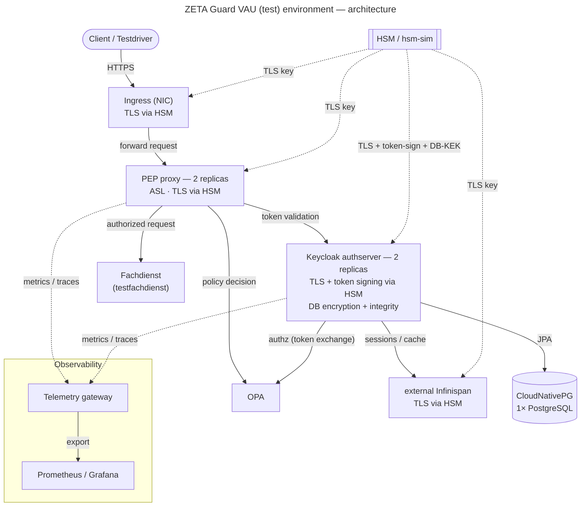

# How to set up a VAU (load/performance-test) environment

This is the "cookbook" for a **complete ZETA Guard stack** hardened like a VAU
and sized so it can serve **load and performance tests**. It ties together the
individual how-to guides and lists the extra settings that make the environment
HSM-backed, highly available and self-contained.

It is aimed at administrators of a Fachdienst operator who want to reproduce a
comparable environment in their own cluster.

## What this environment contains

| Area                  | Setup                                                                                      |
|-----------------------|--------------------------------------------------------------------------------------------|
| Service mesh          | Istio enabled                                                                              |
| PEP proxy             | **2 replicas**, ASL enabled, TLS via HSM                                                   |
| Authserver (Keycloak) | **2 replicas**, TLS via HSM, token signing via HSM, DB column encryption + integrity check |
| Session/cache         | **external Infinispan** (Hot Rod), TLS via HSM                                             |
| Database              | **1× CloudNativePG** PostgreSQL cluster                                                    |
| OCSP                  | **disabled** (PEP ASL + authserver TSL)                                                    |
| Testing               | testdriver, tiger-proxy, exauthsim, testfachdienst, cert-validation-mock, TLS-test-tool    |
| Observability         | telemetry gateway + monitoring backend (Prometheus/Grafana)                                |
| Operations            | manual restarts/changes only; no auto-deploy                                               |

> **ASL via HSM** is **not** part of this recipe yet — the ASL *signer key* is
> still loaded from a mounted file. Only ASL *TLS* uses the HSM. Moving the ASL
> signer key into the HSM is tracked separately.

## Prerequisites (Randbedingungen)

- `helm` and `kubectl` in PATH, kubeconfig pointing at the target cluster.
- **cert-manager** installed —
  see [How to install cert-manager](How_to_install_cert-manager.md).
- **CloudNativePG operator** installed —
  see [CloudNativePG](../explanations/CloudNativePG.md).
- **metrics-server** installed (HPA/`kubectl top` and load-test headroom).
- **Istio** installed in the cluster (the chart only emits
  `PeerAuthentication`).
- An **HSM** reachable over gRPC (PKCS#11 proxy). For a test environment the
  bundled **HSM simulator** (`hsm-sim`) can be used instead — see
  [HSM options](#2-hsm-and-keys) below.
- A docker **registry pull secret** in the namespace — see
  [How to create a docker registry secret](How_to_create_a_docker_registry_secret.md).
- **Resources**: size the pods so the hardware is *not* the bottleneck during
  load tests (comparable to a production-like stage). The chart defaults for
  `authserver`/`pepproxy` are already production-sized; review and raise limits
  per [Referenz des Helm Charts](../../README.md) and the `resources:` blocks in
  [charts/zeta-guard/values.yaml](../../charts/zeta-guard/values.yaml).

## Architecture



> **Transport:** `Client → NIC` is HTTPS (TLS terminated on the NIC with the HSM
> key). All in-cluster traffic is additionally secured by **Istio mTLS**
> (`PeerAuthentication: STRICT`). The HSM link is gRPC.

---

## Recipe

### 1. Cluster prerequisites

Install, in the target cluster: cert-manager, the CloudNativePG operator,
metrics-server, and Istio. Create the namespace and the registry pull secret.

### 2. HSM and keys

The environment uses HSM-backed keys in four places. Provision these key IDs in
your HSM (names are examples; keep them in sync with the values below):

| Purpose               | Example key ID                                       | Used by                         |
|-----------------------|------------------------------------------------------|---------------------------------|
| Authserver + PEP TLS  | `zeta-guard-keycloak-tls-es256-v1.p256` / `tls.p256` | Keycloak & PEP TLS listeners    |
| Token signing (ES256) | `zeta-guard-keycloak-token-es256-v1.p256`            | Keycloak JWT signing            |
| DB encryption KEK     | `vau-db-kek-v1`                                      | Keycloak DB keychain wrapping   |
| Infinispan TLS        | `infinispan.p256`                                    | external Infinispan Hot Rod TLS |

**Real HSM (recommended):** point the components at your HSM
proxy endpoint and import/create the keys above. The TLS/signing certificates
must match the HSM keys.

**HSM simulator (`hsm-sim`, test only):** enable the bundled `hsm-sim`
subchart. It *derives* EC keys deterministically from the key ID (key IDs ending
in `.p256` → P-256) and issues matching certificates from its own CA. Mount the
public certs it needs via `hsmsim.extraKeys` (e.g. `tls.p256.cert.pem`,
`infinispan.p256.cert.pem`). Note the simulator cannot hold an externally
generated private key — it is for functional/load testing, not production.

> **KEK stability:** the DB column encryption is unwrapped with the HSM KEK
> (`vau-db-kek-v1`). If the HSM (or `hsm-sim`) loses/regenerates that key, the
> existing encrypted database can no longer be decrypted and the authserver will
> fail with `ERROR_DECRYPTION`. Keep the KEK stable, or wipe+recreate the DB.

See [How to set up TLS](How_to_set_up_TLS.md) for the HSM TLS wiring
(`store:hsm:` keys via the ossl_hsm provider).

### 3. Secrets

Create these secrets in the namespace before deploying:

- **registry pull secret** — image pulls.
- **`asl-identity`** — ASL signer cert, signer key and issuer cert (the PEP
  mounts these when `asl_enabled: true`). Use the `generate-asl-identity-secret`
  make target or create it directly with the three files.
- **`hsm-tls`** — the public TLS certificate(s) mounted for the HSM-backed TLS
  listeners.
- **image trust chain secret** — for provisioning-processor image verification.
- **DB encryption keychain** (`zeta-authserver-dbenc`) — generated by the
  keychain-generator init container from the HSM KEK.
- **truststores password** (`pdp-truststores-pw`) and, optionally,
  **`opa-bearer`** for OPA bundle pulls.

### 4. Values configuration

The knobs that turn a standard deployment into this VAU/load-test stack, grouped
by requirement. Put them in your environment values file:

```yaml
global:
  istio:
    enabled: true                 # Istio PeerAuthentication
  infinispanExternal: # external Infinispan (session/cache)
    enabled: true
    replicaCount: 1
    hsm:
      enabled: true               # Infinispan TLS via HSM
      endpoint: "hsm-sim:50051"   # or your HSM proxy
      keyId: "infinispan.p256"
      caCert: |
        -----BEGIN CERTIFICATE-----
        ...HSM CA cert...
        -----END CERTIFICATE-----

zeta-guard:
  databaseMode: cloudnative       # 1× CloudNativePG PostgreSQL

  authserver:
    replicaCount: 2               # 2× Keycloak
    dbEnc:
      enabled: true               # DB column encryption + integrity check
    hsm:
      enabled: true
      endpoint: "hsm-sim:50051"   # or your HSM proxy
      dbEnc:
        keyId: "vau-db-kek-v1"
      tls:
        enabled: true             # authserver TLS via HSM
        keyId: "zeta-guard-keycloak-tls-es256-v1.p256"
      tokenSigning:
        enabled: true             # JWT signing via HSM (realm must use ES256)
        keyId: "zeta-guard-keycloak-token-es256-v1.p256"

  pepproxy:
    replicaCount: 2               # 2× PEP
    asl_enabled: true             # ASL
    aslOcsp: "off"                # OCSP off (PEP ASL)
    hsmProxyAddr: "hsm-sim:50051" # PEP TLS via HSM (ossl_hsm)

  nginxIngressHsm: true           # HSM TLS on the NIC ingress

  provisioningProcessor:
    tslOcspEnabled: false         # OCSP off (authserver/SMC-B TSL)
```

Notes:

- **2× Keycloak requires external Infinispan** (the embedded cache is not shared
  across pods) —
  see [How to use external Infinispan](How_to_use_external_infinispan.md).
- **OCSP off is two settings**: `pepproxy.aslOcsp: "off"` (PEP) *and*
  `provisioningProcessor.tslOcspEnabled: false` (authserver). Setting only one
  leaves OCSP partly active.
- **Token signing via HSM** needs the realm's
  `defaultSignatureAlgorithm: ES256`;
  the KeyProvider component is registered during post-deploy configuration, not
  by the plugin —
  see [How to configure the authserver](How_to_configure_authserver.md).
- **Monitoring/telemetry**: enable the telemetry gateway and a monitoring
  backend
  (Prometheus/Grafana) — see [Telemetry](../explanations/Telemetry.md).
- **Testsuite components** (testdriver, tiger-proxy, exauthsim, testfachdienst,
  cert-validation-mock, TLS-test-tool) are toggled via the umbrella `tags:` and
  their subchart values —
  see [How to run the tiger testsuite](How_to_run_tiger_testsuite.md)
  and [How to configure tiger-proxy](How_to_configure_tiger-proxy.md).
- **Ingress**: one hostname, TLS terminated on the NIC with the HSM key — see
  [How to configure Ingress](How_to_configure_Ingress.md).

### 5. Deploy

Deploy the umbrella chart with your values file, following
[How to deploy ZETA Guard](How_to_deploy_ZETA_Guard.md). On the **first**
install
also provide `authserver.admin.password`, `authserver.genesisHash` and
`authserver.smcbHashingPepper`.

### 6. Post-deploy configuration

Run the Keycloak realm/policy configuration (Terraform) so the realm exists and
the ES256 HSM KeyProvider is registered. See
[How to configure the authserver](How_to_configure_authserver.md).

### 7. Verification

- `kubectl get pods` — 2× authserver, 2× pep, 1× infinispan, 1× DB, testsuite
  and monitoring all Ready.
- Authserver log shows external Infinispan (Hot Rod) connected and, if OCSP is
  off, `OCSP checking disabled` (no `ocsp-signers.p12` error).
- PEP log shows the ossl_hsm provider loading the TLS key from the HSM (no
  `emerg`), and the protected-resource metadata advertises
  `"zeta_asl_use": "required"`.
- A full client flow through the PEP (e.g. via the testdriver) reaches the
  Fachdienst.

---

## Operational notes

- **Manual only.** This environment is not auto-deployed; restarts and changes
  are performed manually/on demand .
- **PEP scaling / sticky sessions.** With `pepproxy.replicaCount > 1` the ASL
  session state is per-pod, so client requests must stick to one PEP pod. Ensure
  the ingress uses a consistent-hash / sticky routing so a client stays on the
  same pod for the duration of its ASL session.
- **Load-test headroom.** Raise CPU/memory requests+limits and DB pool sizes so
  the platform, not ZETA Guard, is the limiting factor.
- **HSM KEK stability** (see step 2) — the single most common cause of a broken
  redeploy.

## Troubleshooting

| Symptom                                                                         | Cause / fix                                                                                                                                                                                         |
|---------------------------------------------------------------------------------|-----------------------------------------------------------------------------------------------------------------------------------------------------------------------------------------------------|
| Authserver `FATAL ... ERROR_DECRYPTION: mac check in GCM failed`                | DB was encrypted with a different HSM KEK than the one now active. Keep the KEK stable, or wipe+recreate the DB so it re-encrypts with the current key.                                             |
| Authserver `No valid data file found ... ocsp-signers.p12`                      | OCSP disabled on the init container but the OCSP keystore env is still set. Ensure `provisioningProcessor.tslOcspEnabled: false` gates both the init flag and the authserver `OCSP_KEYSTORE_*` env. |
| PEP `Pending`, `secret "asl-identity" not found`                                | Create the `asl-identity` secret (step 3) before deploying with `asl_enabled: true`.                                                                                                                |
| PEP `SSL_CTX_use_PrivateKey("store:hsm:…") failed`, connecting to `[::1]:50051` | `HSM_PROXY_ADDR` not set on the PEP pod → set `pepproxy.hsmProxyAddr`.                                                                                                                              |
| Token exchange 500, `NumberFormatException` on a realm attribute                | Known interaction between column encryption and the clusterless/remote realm cache / raise with the keycloak-zeta owners.                                                                           |

## Related guides

- [How to deploy ZETA Guard](How_to_deploy_ZETA_Guard.md)
- [How to set up TLS](How_to_set_up_TLS.md)
- [How to use external Infinispan](How_to_use_external_infinispan.md)
- [How to configure the authserver](How_to_configure_authserver.md)
- [How to configure Ingress](How_to_configure_Ingress.md)
- [How to run the tiger testsuite](How_to_run_tiger_testsuite.md)
- [CloudNativePG](../explanations/CloudNativePG.md) · [Telemetry](../explanations/Telemetry.md)
